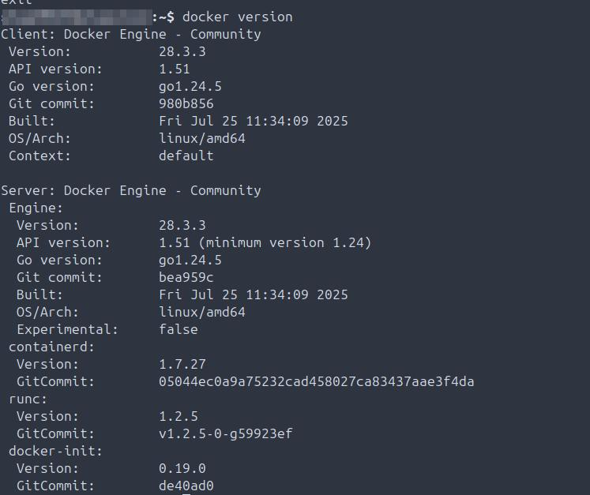
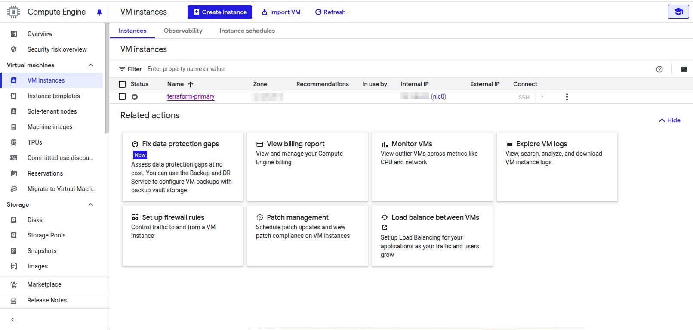
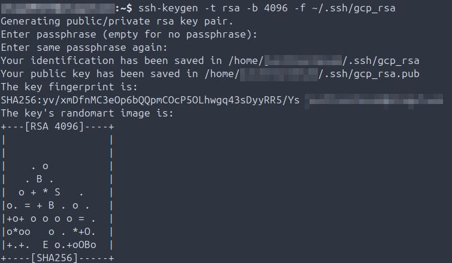
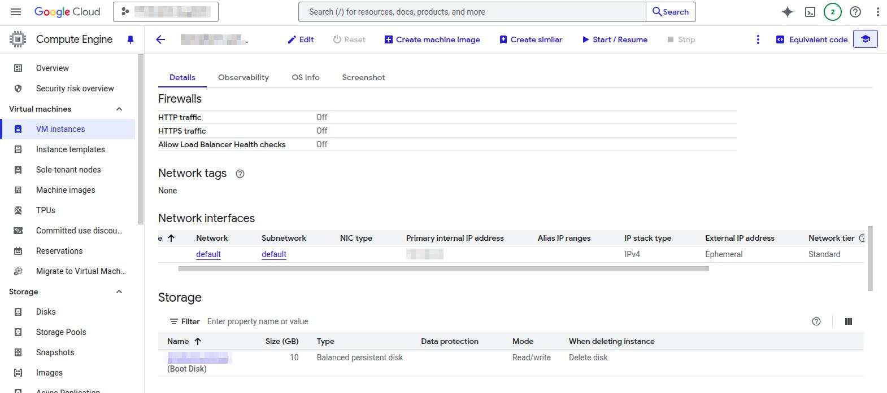
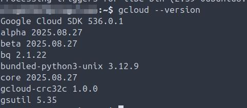
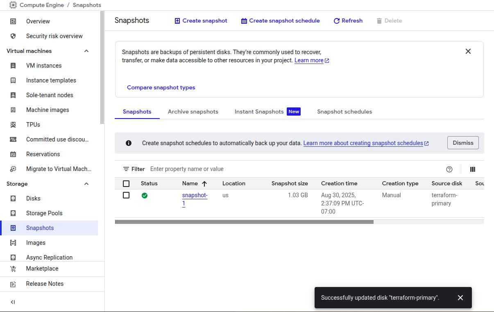
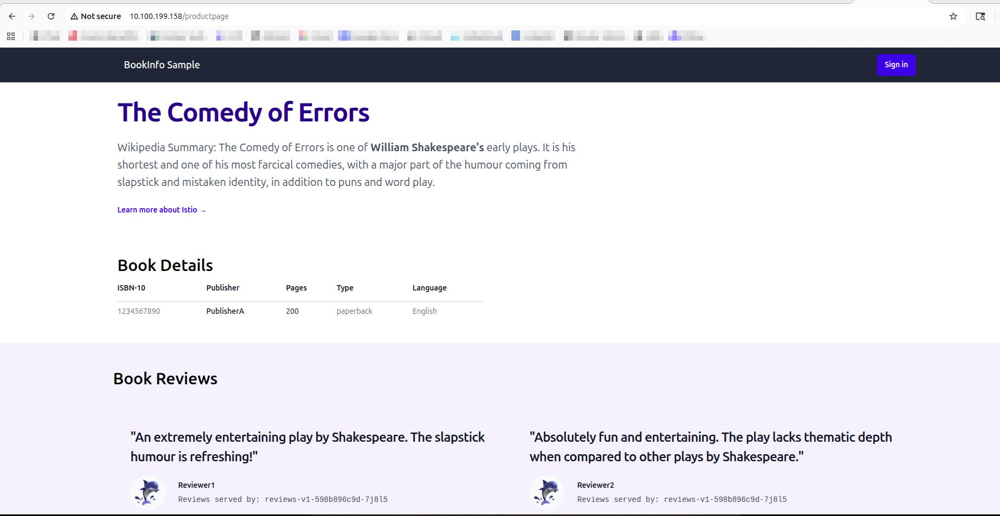
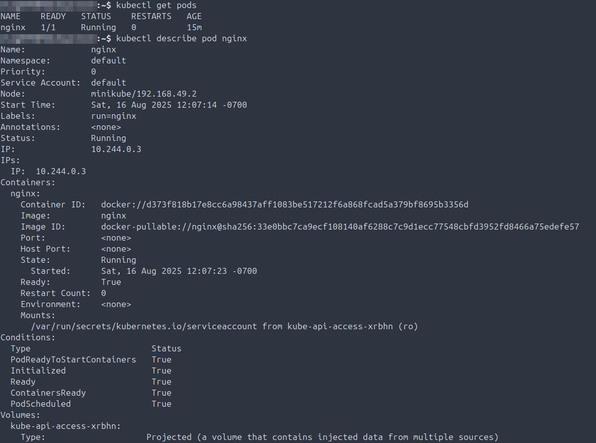
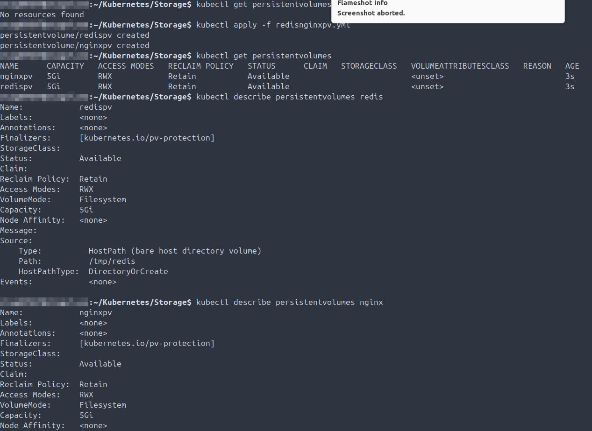
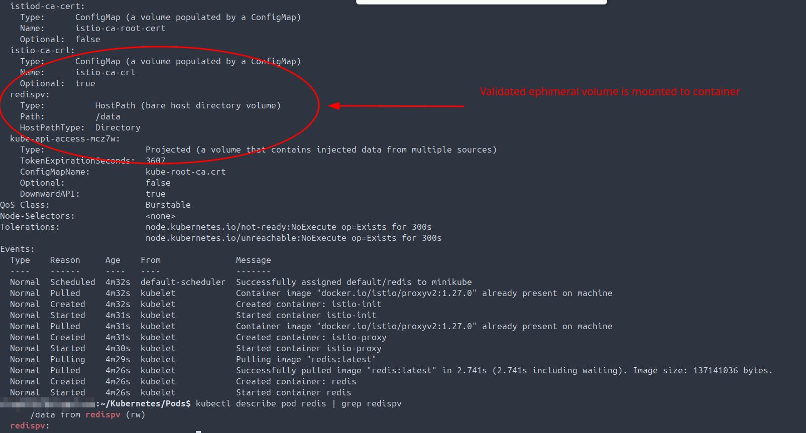

## Scope
This repo covers all projects, tasks, and troubleshooting completed in preparation for obtaining the KCNA, demonstrating both hands-on Kubernetes skills and practical knowledge.

## Environment
- Docker: 28.3.3
- GCP Compute Engine, Cloud Storage
- Istio Demo Profile: 1.27.0
- kubectl: 1.33.4
- Minikube: v1.33.1
- Minikube: v1.33.1
- Terraform: v1.13.1
- Ubuntu 24.0.3 LTS
- Visual Studio Code: v1.103.1
- YAML 

```
├── README.md
├── Screenshots
│   ├── Deployments/
│   ├── Docker/
│   ├── GCP/
│   ├── Istio/
│   ├── Minikube/
│   ├── Namespaces/
│   ├── Networking/
│   ├── Pods/
│   ├── ReplicaSets/
│   ├── Security/
│   ├── ServiceAccounts/
│   └── Storage/
├── Manifests 
├── Deployments
│   ├── Manifests
│   └── Testing, scale up, scale down, rollouts and rollbacks
├── Docker
│   ├── Installation
│   ├── Persistent Volume creation; pod administration and data management
│   └── Version
├── GCP
│   ├── Bucket and VM provisioning; VM network settings tuning
│   ├── VM primary disk adhoc snapshots and scheduled snapshots
│   └── Install and validate Terraform
├── Istio
│   ├── Installation
│   ├── Version
│   └── Install, test, validate and cleanup Bookclub application
├── Minikube
│   ├── Installation
│   ├── Create, validate, destroy
│   ├── Install, test and validate kubectl
│   ├── Provision external load balancer to externally expose Istio Bookclub application traffic
│   └── Troubleshooting
├── Namespaces
│   ├── Manifests
│   ├── Create namespace
│   └── Validate taints
├── Networking
│   └── Troubleshooting
├── Pods 
│   ├── Pods
│   ├── Manifests
│   ├── Troubleshooting
│   ├── Additional pod creation and api-resources validation
│   └── Manifest pod creation
├── ReplicaSets
│   ├── Manifests
│   └── Pods 
├── Security
│   └── Certificates
└── ServiceAccounts
│   ├── Manifest creation
│   ├── Attach to pods
│   └── Troubleshooting
```
## Deployments
- 2025-08-17 Create new deployment manifest, create the deployment, validate the pod status.
  
- 2025-08-17 Validate the details of the newly created deployment.
  
- 2025-08-17 Validate replicas are auto-scaling to the correct amount as intended per deployment specifications.
  
- 2025-08-17 Validate all components of the new deployment are present, running, and in the intended state.
  
- 2025-08-17 Delete the current deployment, scale up replicas to desired count, create a new deployment, validate both the replica count and deployment health.
  
- 2025-08-17 Delete the current deployment, create and rollout a new deployment, validate 6/6 pods are up and healthy.
  
- 2025-08-17 Create and annotate new deployment, roll it out, check the history and confirm the change-cause annotation is logged.
  
- 2025-08-17 Validate the change-cause is annotated when describing the deployment.
  
- 2025-08-17 Update the deployment manifest to a different image version, annotate the change-cause, rollout the deployment, then validate the deployment history.  
  
- 2025-08-17 Validate the scaling of replicas in the deployment manifest.
  
- 2025-08-17 Downgrade to version 3.21, validate this failed, rollback to version 3.22, validate change-cause annotations, validate the deployment, validate the number of pods and their health.
  
- 2025-08-19 Update the deployment manifest with an image version that does not exist, confirm the rollout produces an error, confirm the number of pods up is 6 as expected and the other 3 are in a broken state due to trying to pull an image version that does not exist off DockerHub.
  
- 2025-08-19 Rollback deployment, confirm the pods terminated and the correct amount of replicas are now running.
  
- 2025-08-19 Validate the image version has been rolled back to the desired version.
  
- 2025-08-19 Validate the replica count is correct by describing the deployment.
  

## Docker
- 2025-08-13 Install Docker and Launch Hello World container.
  
- 2025-08-13 Validate locally installed version.
  
- 2025-09-01 Create local volume on node then validate available.
  
- 2025-09-01 Start container with attached local volume, validate pod is writing to attached volume, connect into pod via exec -it, validate data is being written to volume from pod.
  

## GCP
- 2025-08-29 Create storage buckets in GCP project for compute VMs, prometheus monitoring/observability and kubernetes.
  
- 2025-08-29 Create primary VM in GCP project to provision worker VMs with terraform.
  
- 2025-08-29 Create RSA keypair on main workstation to vacilitate SSH RSA authentication to primary GCP VM.
  
- 2025-08-29 Add public key to primary GCP VM then validate SSH authentication from main workstation.
  
- 2025-08-29 Install terraform and validate on primary GCP VM.
  
- 2025-08-29 Create bash script on primary workstation to facilitate faster SSH authentication to primary GCP VM.
  
- 2025-08-29 Change primary terraform GCP VM IP address type to standard ephemeral as well as network type to standard in GCP compute.
  
- 2025-08-29 Install and validate the gcloud shell on main workspace.
  
- 2025-08-29 Assign primary VM persistent disk to snapshot schedule.
  
- 2025-09-01 Validate primary disk for terraform bastion host has been assigned to VM snapshot schedule, validate run times.
  
- 2025-09-01 Create one off snapshot for primary disk or bastion host/terraform VM and validate it succesfully completed.
  

## Istio
- 2025-08-24 Install Istio with demo profile, then validate the installation stability.
  
- 2025-08-13 Validate locally installed Istio version.
  
- 2025-08-29 Install Bookclub app in Istio default namespace with demo profile, validate services and pods are running.
  
- 2025-08-29 Validate Bookclub app in Istion default namepace is accepting HHTP requests served up by praqma pod utilizing curl. 
  
- 2025-08-29 Create gateway and virtual networking services in Istio default namespace, confirm the gateway is up, export the INGRESS_NAME var, validate the gateway external IP has been created and is available, export the INGRESS_PORT, SECURE_INGRESS_PORT and TCP_INGRESS_PORT variables.
  
- 2025-08-29 Validate the Bookclub app is accesible via CURL in the default Istio namespace.
  
- 2025-08-29 Validate both the load balancer external IP & internal cluster IPs have been provisioned and are available, confirm the $GATEWAY_URL variable IP via echo matches the external IP of the load balancer.
  
- 2025-08-29 Validate the Bookclub app IP has been exposed externally and is reachable via a browser.
  
- 2025-08-29 Validate the Bookclub app is externally exposed and is serving up round robin reviews as expected from the application running in the default Istio namespace.
  
- 2025-08-29 Cleanup and shutdown the Bookclub application running in the default Istio namespace.
  

## Minikube
- 2025-08-12 Install Minikube.
  
- 2025-08-12 Start cluster and Minikube version validation.
  
- 2025-08-12 Validate the cluster is running, stop the cluster, then delete.
  
- 2025-08-14 Install kubectl, start the cluster, validate cluster info, validate kubectl version.
  
- 2025-08-16 Determined Minikube is not launching because it is not started, and when it is starting it is starting with too much memory allocated.
  
- 2025-08-16 Fix Minikube not starting, reduce memory allocation create pod, create nginx pod.
  
- 2025-08-29 Start and validate external load balancer in minikube and validate running.
  

## Namespaces 
- 2025-08-19 Create namespace manifest then create first namespace.
  
- 2025-08-19 Create namespace with kubectl command.
  
- 2025-08-19 Check if any taints are currently set on the node.
  

## Networking
- 2025-08-24 TROUBLESHOOTING: Create network policy manifest, apply to node, identify and correct JSON error in manifest, apply and validate applied to pod.
    

## Pods
- 2025-08-16 Validate running pods on the node and then review pod details.
  
- 2025-08-16 Delete the pod and validate no longer running on the node.
  
- 2025-08-16 Create the manifest then validate both spacing and contents are correct.
  
- 2025-08-16 TROUBLESHOOTING: Pod not starting due to a crash loop.
  
- 2025-08-16 TROUBLESHOOTING: The wrong image is defined in the pod manifest.
  
- 2025-08-16 TROUBLESHOOTING: The incorrect image version is defined in the pod manifest.
  
- 2025-08-16 Describe running pods and review applicable details, specifically start process for all three.
  
- 2025-08-16 Create a manifest for all three pods, start them, validate 3/3 are now running on the node.
  
- 2025-08-16 Delete all three pods then validate they are gone on the node.
  
- 2025-08-23 TROUBLESHOOTING: Pod won't create due to the image name not matching the correct vernacular that is on DockerHub.
  
- 2025-08-23 TROUBLESHOOTING: The Prometheus pod will not start, found that the image in the manifest was incorrect. Deleted the pod.
  
- 2025-08-23 Validating all available api-resources on the node.
  
- 2025-08-29 Write manifest for praqma pod, start pod, validate running.
  
- 2025-09-01 Write manifest and create golang pod, confirm running, connect to pod (exec -it), validate data is being created in the mounted hostPath volume.
  
- 2025-09-01 Describe golang pod, then confirm the hostPath volume is mounted via describing the pod.
  

## ReplicaSets
- 2025-08-17 ReplicaSet manifest created in Visual Studio Code, validate accessible through bash shell locally.
  
- 2025-08-17 Create ReplicaSet manifest in bash, then validate the correct number of pods are started running in a healthy state.
  
- 2025-08-17 Create new pod manifest in Visual Studio Code, validate available in bash, to be used with Replicaset testing.
  
- 2025-08-17 Confirm correct number of pods defined in the Replicaset are running.
  
- 2025-08-17 Delete a pod, then validate the Replicaset created and started new pod, validate 3/3 are running, so HA is functioning as intended.
  
- 2025-08-17 Check the details of the Replicaset, specifically checking for both replica and pod counts.  
  
- 2025-08-17 Edit the Replicaset manifest, scale the number of replicas to 4, confirm the fourth pod has been started, and is now running.  
  
- 2025-08-17 Scale down the number of replicas to 2, without editing the manifest (using CLI syntax), then validate that only two pods are running.  
  
  
## Security
- 2025-08-21 Create the root certificate.
  
- 2025-08-21 Create and sign an administrator certificate.
  
- 2025-08-21 Create and sign the system masters certificate.
  
- 2025-08-21 Create and sign certificates for the kube-scheduler, kube-controller-manager and kube-proxy services.
  

## ServiceAccounts
- 2025-08-21 Create a service account, validate on the node, describe the service account.
  
- 2025-08-21 Describe a pod with an attached service account.
  
- 2025-08-23 Grab Java Web Token (JWT) for the Prometheus pod.
  
- 2025-08-23 Install jq locally to view the decoded token JSON, view both the exp and iat values in the token, calculate to confirm the token expiration is set for one year. Both are set in seconds and the formula for determining the token TTL is exp - iat = token expiration date.
  
- 2025-08-23 TROUBLESHOOTING: The manifest is not creating either the serviceaccount or the pod, Visual Studio Code (VSC) is not updating the manifest on the node. Updated the manifest on the node then deleted the pod, re-applied the manifest, validated each have now been created.
  

## Storage
- 2025-09-01 Write Persistent Volume manifest for both the reddis and nginx pods, validate each has been created and review details for each via kubectl describe.
  
- 2025-09-01 Write manifest for both nginx and redis pods, start and validate running 2/2; facilitate understanding of the diferential between persistent volume and ephimeral storage.
  
- 2025-09-01 Describe the reddis pod and validate the automatically created ephimeral volume is present and mapped to the pod; further validation of the mountpoint attached to the pod.
  
- 2025-09-01 Describe the nginx pod and validate the automatically created ephimeral volume is present and mapped to the pod; further validation of the mountpoint attached to the pod.
  
